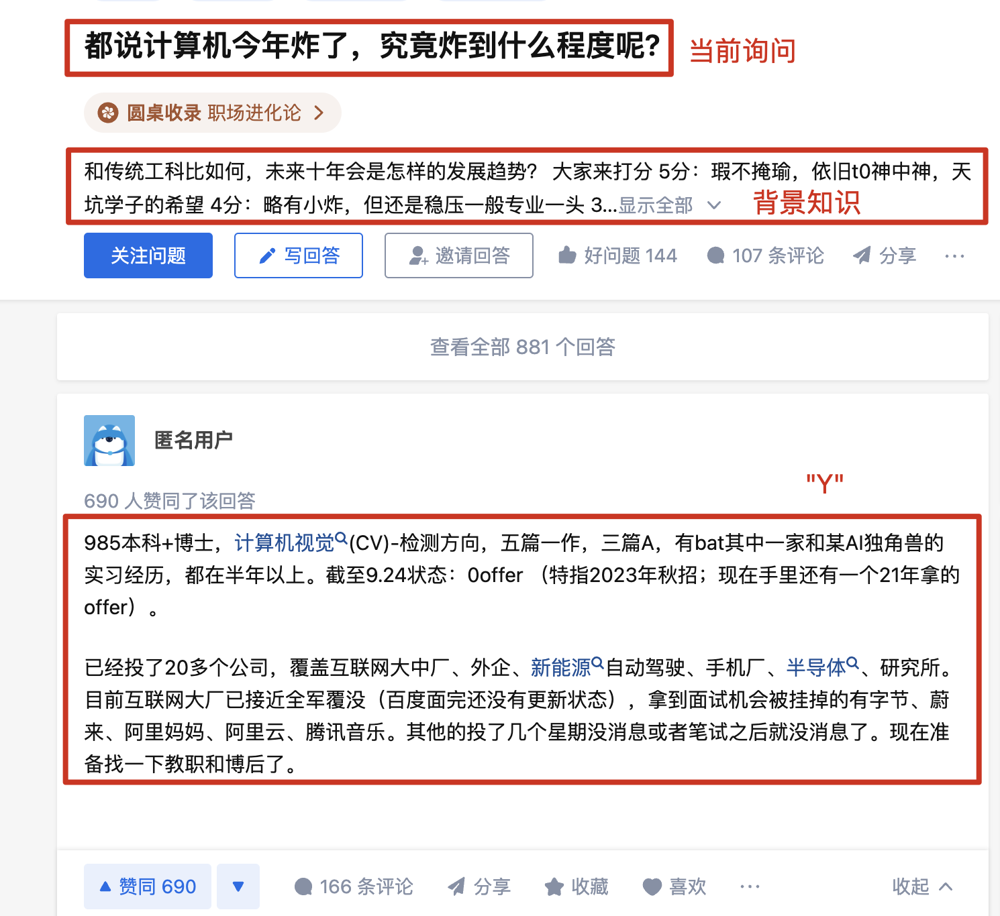
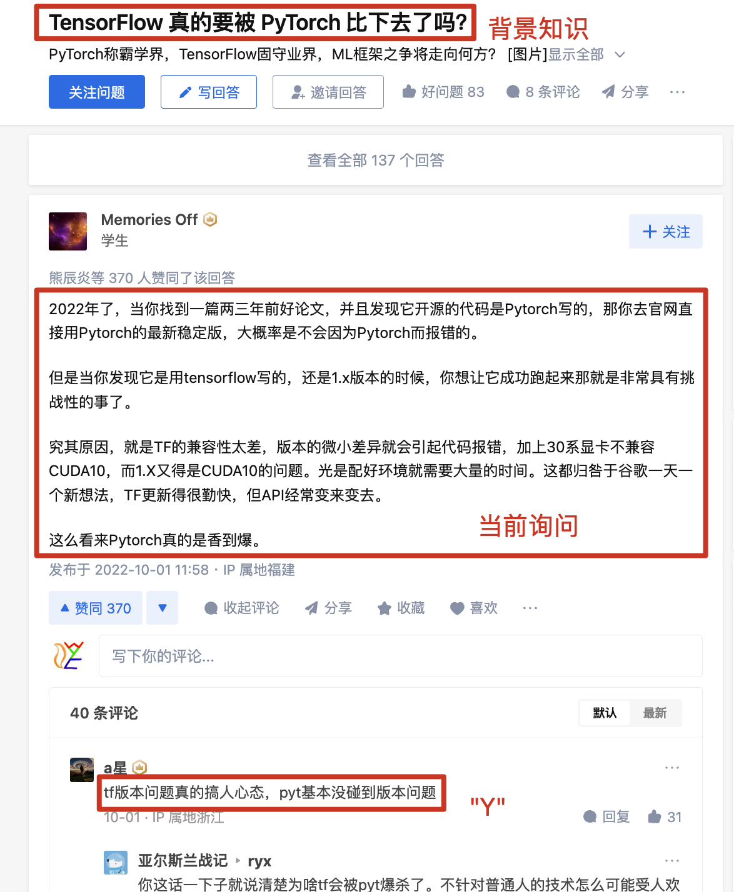

# ZHIHU数据集说明

> by WangYC

## 基本信息

* questions_answers.jsonl

​	13G

​	10,163,886条

* answers_comments.jsonl

​	113G

​	24,184,812条

* questions_answers_200.jsonl

​	4.3G

​	6,831,403条

* answers_comments_200.jsonl

​	2.6G

​	3,849,067条

## 格式说明

### questions_answers.jsonl

```json
{
    "来源标识": "知乎",
    "主题": "",
    "背景知识": "冰火含权游中你最喜欢的人物和最讨厌的人物分别是谁可多选，为什么呢？",
    "对话历史": "",
    "与Query相关的标准知识问答": [
        {
            "问题": "",
            "上下文": "",
            "答案": ""
        }
    ],
    "当前询问": "《冰与火之歌》中你最喜欢和最讨厌的人物是谁？",
    "后续对话": "",
    "Y": "最爱的女性角色应该就是小玫瑰吧坚强勇敢有野心"
}
```



### answers_comments.jsonl

```json
{
    "来源标识": "知乎",
    "主题": "",
    "背景知识": "如何评价小米在 2019 年 4 月 23 日发布的小米壁画电视？有哪些优势和不足？",
    "对话历史": "",
    "与Query相关的标准知识问答": [
        {
            "问题": "",
            "上下文": "",
            "答案": ""
        }
    ],
    "当前询问": "原本小米产品经理这边有跟我说上半年有新品，不过我也不好意思问太细致，毕竟涉及商业机密，所以也是两点钟看的发布会，准备过几天去小米之家看看实物。首先从普通电视层面分析，电视嘛，看画面的，最重要的当然应该是画质好不好。不过很多人不懂电视，不知道怎么评价电视好坏，看电视也是安卓系统，就拿评价手机的套路去评价电视，怎么评价呢？当然就是看性能强不强，也就是看运行内存和存储空间。要知道，国产谁家电视性能最强？不是小米哦，其实是乐视电视，恐怕乐视电视的性能真的是举世无双，看看，3运行内存，72双核53双核处理器，32存储空间，牛不牛？这可比小米电视性能强多了，结果呢？结果乐视倒闭了回到开头，一台智能电视好不好，最重要的还是看画质好不好，而不是性能强不强，当然了，性能是重要的，但是并非第一重要。而画质好不好，则是看电视上画质处理技术的使用，比如运动补偿，光控分区，画质处理芯，广色域技术，1000尼特的屏幕峰值亮度等，不是看屏幕是不是进口的哦！这又是另一个重大且普遍的误解了，这里不详细展开。关于电视的画质处理技术，请参考高端智能电视应该有哪些画质处理技术蓝大仙人的文章知乎53428716小米这款屏幕是真4吗？是的，目前小米电视没有假4的。全面屏这款没数据，大概率是国产屏幕。壁画版说了是三星屏智能电视真4屏幕面板与假4的区别。蓝大仙人的文章知乎53427321那么小米这款电视用了哪些画质处理技术呢？支持是真的吗？对不起，没有用到，以上提到的画质处理技术均未用到。连运动补偿都没有。没有运动补偿的电视，在观看高速运动的画面时，比如篮球足球比赛，画面会出现比较明显的拖影模糊抖动情况。也仅仅是支持解码而已，由于没有画质处理技术的支持，显示不出效果。但是这个价位没运动补偿正常吗？不正常，6000上下国产传统品牌普遍都有运动补偿了。甚至索尼657500也有。小米壁画电视性能算强吗？说实话，这个性能在这个价位只能算中等，没有明显优势。那小米壁画电视有什么优势呢？外置音响，这个效果还是比内置音响的电视好的。超薄屏幕，普通液晶电视由于放置主板，难免突出一大块，小米这款是分体的，所以可以做平。但是分体式主机不等于网络机顶盒，不可随便替换，用盒子也是插分体主机上，而不是插电视上。远场语音，配合小爱同学，这个功能传统国产品牌，线下款普遍都做了，还是比较实用的功能。支持远程控制米家设备，这个功能也是比较实用的，毕竟米家设备种类还是挺多的，价格也亲民，我家就有好几件，智能家庭设备种类一定要多，不然这个功能就是鸡肋，传统国产品牌电视这方面生态就远不如小米。再说一下小米电视的定位和布局，小米电视就是定位中低端，布局中低端市场，不跟传统品牌争中高端，也确实没这个实力去争，中低端才是市场主力，占80的市场份额，小米是成功的，看销量就知道了，同时小米很多机型也不靠硬件赚钱，总体配置还算良心。如果说社会上有80的穷人，20的富人，那么小米的用户群主要就是这80的人，他们对价格敏感，就算用上了顶尖的技术，也没人买账，因此小米电视只要在保证基本功能的前提下，尽可能降低价格，把55寸4电视降价到2500元内，43寸高清降低到1500元内，消费者就美滋滋买买买。况且小米也不靠卖硬件赚钱，重要的是占领尽可能多的市场，然后用广告等方式后期盈利。所以小米真的不需要啥高端技术，没必要。2019年一月最新智能电视选购攻略蓝大仙人的文章知乎53975303智能电视真4屏幕面板与假4的区别。蓝大仙人的文章知乎534273213293二维码自动识别",
    "后续对话": "",
    "Y": "感觉运动补偿很重要，我家电视看速度快的就糊"
}
```



## split.sh

用于将文件切成小块

```shell
bash split.sh questions_answers.jsonl
```

修改参数：

```shell
7 batch_size=100000 #指定每个文件多少个json块
8 src_filename=$1 #answer_comment.jsonl
9 dst_dir='./post_split'
```
## revise.sh

用于将格式修改成jsonl可以直接加载的格式
使用方法：将脚本和py文件放到post_processed文件夹中，执行脚本。
修改参数：
根据具体的数据格式修改line_iter每次相加的行数量
根据实际文件的数量修改脚本中的$iterator

数据在服务器中位置：node1:/data/wangyuanchun/chinese_data/zhihu/processed/parse/zhihu_WangYC
